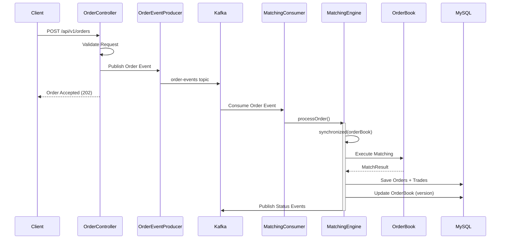
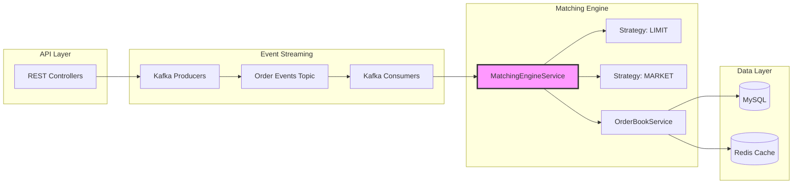

# Order Matching Engine

A cryptocurrency exchange order matching engine built with Spring Boot, featuring thread-safe concurrent order processing and price-time priority matching.

## Overview

This project implements a core order matching system with the following characteristics:

**Core Features**
- LIMIT and MARKET order matching with price-time priority (FIFO) algorithm
- Thread-safe order book using ConcurrentSkipListMap
- Three-level concurrency control: per-symbol synchronization, optimistic locking with retry, and transactional boundaries
- RESTful APIs for order management and order book queries
- Event-driven architecture with Kafka for asynchronous order processing
- Redis-based distributed locking and order book caching

**Tech Stack**
- Spring Boot 3.5.8, Java 17, Maven
- MyBatis 3.0.5 with MySQL (H2 for tests)
- Apache Kafka for event streaming
- Redis/Redisson for distributed locks and caching
- Prometheus metrics via Spring Boot Actuator
- Springdoc OpenAPI 3 (Swagger UI)

## Order Matching Flow



**Matching Logic**

LIMIT Orders (Price-Time Priority):
- Buy orders match when `sellPrice <= buyPrice`
- Sell orders match when `buyPrice >= sellPrice`
- FIFO within the same price level
- Partially filled orders remain in order book

MARKET Orders (Immediate Execution):
- No price constraints, match at best available prices
- Cross multiple price levels until filled or liquidity exhausted
- Partially filled orders do NOT stay in order book

## System Design

### Architecture Overview



### Concurrency Control

**1. Per-Symbol Synchronization**
```java
synchronized (orderBook) {
    // Lock per trading symbol, allows parallel processing of different symbols
    MatchResult result = matchingStrategy.match(order, orderBook);
}
```

**2. Optimistic Locking**
```java
@Retryable(maxAttempts = 3, backoff = @Backoff(delay = 100))
public void saveOrderBook(OrderBook orderBook) {
    // Version-based conflict detection
    orderBookMapper.updateOrderBook(orderBook);
}
```

**3. Transactional Boundaries**
```java
@Transactional
public MatchResult processOrder(Order order) {
    // Atomic persistence of orders, trades, and order book state
    // Rollback on any exception
}
```

## Project Structure

```
src/main/java/cex/crypto/trading/
├── config/                          # Spring configuration
│   ├── MyBatisConfig.java
│   ├── KafkaProducerConfig.java
│   ├── KafkaConsumerConfig.java
│   └── RedisConfig.java
├── controller/                      # REST endpoints
│   ├── OrderController.java
│   └── OrderBookController.java
├── domain/                          # Entity models
│   ├── Order.java
│   ├── Trade.java
│   └── OrderBook.java
├── dto/                             # Data transfer objects
├── enums/                           # OrderSide, OrderType, OrderStatus
├── event/                           # Kafka event models
├── exception/                       # Custom exceptions
├── mapper/                          # MyBatis mappers
├── service/
│   ├── MatchingEngineService.java   # Core matching orchestration
│   ├── OrderService.java            # Order lifecycle
│   ├── OrderBookService.java        # Order book management
│   ├── TradeService.java            # Trade recording
│   └── kafka/                       # Kafka producers/consumers
└── strategy/                        # Matching algorithms
    ├── LimitOrderMatchingStrategy.java
    └── MarketOrderMatchingStrategy.java

src/main/resources/
├── mapper/*.xml                     # MyBatis SQL mappings
├── schema.sql                       # Database schema
└── application*.properties          # Configuration
```

## Quick Start

### Prerequisites

- Java 17+
- Maven 3.8+
- MySQL 8.0+
- Apache Kafka 3.x
- Redis 7.x

### 1. Database Setup

```sql
CREATE DATABASE trading;
```

Configure connection in `application.properties`:
```properties
spring.datasource.url=jdbc:mysql://localhost:3306/trading
spring.datasource.username=root
spring.datasource.password=your_password
```

### 2. Start Dependencies

```bash
# Start Kafka + Zookeeper
./start-kafka.sh

# Or use Docker Compose (if available)
docker-compose up -d
```

### 3. Build and Run

```bash
# Build
./mvnw clean install

# Run application
./mvnw spring-boot:run

# Or run packaged JAR
java -jar target/trading-0.0.1-SNAPSHOT.jar
```

**Run Tests**
```bash
./mvnw test
```

### 4. Verify Installation

```bash
# Health check
curl http://localhost:8080/actuator/health

# Swagger UI
open http://localhost:8080/swagger-ui.html
```

## Configuration

### Application Profiles

**application.properties** (Main)
```properties
server.port=8080
mybatis.mapper-locations=classpath:mapper/*.xml
```

**application-kafka.properties** (Kafka)
```properties
spring.kafka.bootstrap-servers=localhost:9092
spring.kafka.consumer.group-id=matching-engine
```

**application-test.properties** (Testing)
```properties
spring.datasource.url=jdbc:h2:mem:testdb;MODE=MySQL
spring.kafka.enabled=false
```

## License

MIT License
